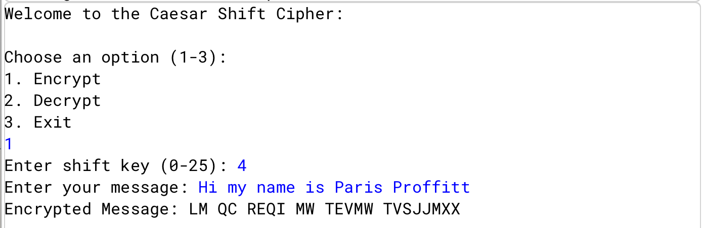
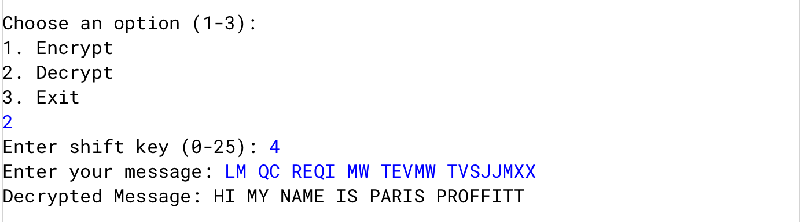
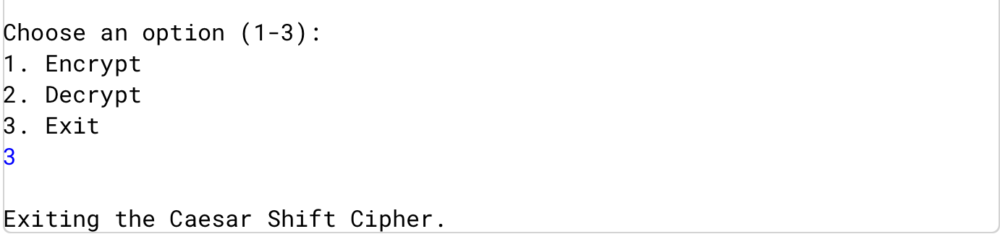

# Caesar Shift Cipher (Encryption & Decryption)
This project implements a **Caesar Shift Cipher** in Java.  
The Caesar Cipher is one of the simplest and most widely known encryption techniques. It works by shifting each letter of the plaintext by a fixed number of positions down the alphabet.

## Features
- Encrypts messages using a shift key  
- Decrypts messages using the same key  
- Works with both uppercase and lowercase letters  
- Ignores non-alphabetical characters (they remain unchanged)  

## How It Works
1. **Encryption**  
   Each letter is shifted forward by the key.   

   

2. **Decryption**  
   Each letter is shifted backward by the key.    

   

3. **Exiting**
   The program will repeatedly ask the user to select an option until the user selects 3, which exits the program.

   
